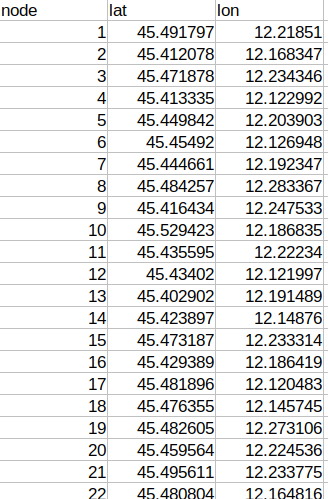

Data format
===========

----------------
Node coordinates
----------------
The data files containing geographical coordinates for each node are separate from the ones containing requests
information. The coordinates are contained in files whose name ends with 'geo.csv'. Here is a simple example:

------------------
VRPLIB data format
------------------

Requests data format is based on Gerhard Reinelt's work ([Rein91]_). This is clearly explained in the documentation available `here <http://comopt.ifi.uni-heidelberg.de/software/TSPLIB95/>`_.

For clarity and completeness, the description is reproduced here. 

Each file consists of a **specification part** and of a **data part**. The specification 
part contains information on the file format and on its contents. The data part contains 
explicit data.

The specification part
**********************
This indicates the type of problem (TSP - symmetric traveling salesman problem, ATSP -
asymmetric traveling salesman problem, CVRP - capacitated vehicle routing problem). For 
the purpose of this project, the Capacitated Vehicle Routing Problem with Pickup and Delivery with Time Windows (CVRPPDTW) is of interest. To be precise, the goal of this work is 
to create a solver for the **dynamic** case of the latter problem.
Since this specific instance is not described, we extend the notation of [Rein91]_ to 
tackle it.

In this part, the following information is provided:

- File name
- Comment
- Type of problem
- Dimension of the problem (intended as the number of customers)
- Type of edge weight
- Capacity of the vehicles
- Number of vehicles 

The data part
*************
The data part is divided in sections:

- **Nodes section** giving start and end node for each customer
- **Demand section** indicating demand for each customer 
- **Time window section** giving the pick up and delivery time windows for each customer
- **Depot section** indicating the possible depot nodes and terminating at -1

Small examples
**************

>>> *Example data*
NAME : example_data.knd 
COMMENT : 
TYPE : CVRPPDTW
DIMENSION : 10
EDGE_WEIGHT_TYPE : EUC_2D
NUM_VEHICLES : 2
CAPACITY : 101
NODES_SECTION
1  42 7
2  89 22
3  7  13
4  60 41
5  24 45
6  12 23
7  19 68
8  98 33
9  32 85
10 22 6
DEMAND_SECTION
1 1
2 1
3 2
4 5
5 1
6 3
7 1
8 4
9 1
10 2
PICKUP_TIME_WINDOW_SECTION
1   8:45  9:30
2   7:30  9:15
3   7:45 12:30
4  11:45 14:45
5  11:45 14:00
6  10:15 12:45
7  10:15 12:00
8   7:15 10:45
9   7:15 11:15
10  9:15 12:45
DELIVERY_TIME_WINDOW_SECTION
1  10:45  11:30
2   8:30 10:15
3   9:45 15:30
4  13:45 16:45
5  13:45 16:00
6  12:15 14:45
7  11:15 13:00
8   9:15 12:45
9   9:15 13:15
10 10:15 13:45
DEPOT_SECTION
0
49
50
51
-1
EOF

In example above, the problem type is CVRPPDTW, the number of customers is 10 (numbered from 1 to 10) and the used notion of distance is euclidian distance. There are 2 vehicles, each with a capacity of 101. The depots are nodes ``0, 49, 50, 51``.

>>> *Example data*
NAME : example_data.knd 
COMMENT : 
TYPE : MDCVRP
DIMENSION : 10
EDGE_WEIGHT_TYPE : EUC_2D
NUM_VEHICLES : 2
CAPACITY : 101
NODES_SECTION
1  42 
2  89 
3  7  
4  60 
5  24 
6  12 
7  19 
8  98 
9  32 
10 22 
DEMAND_SECTION
1 1
2 1
3 2
4 5
5 1
6 3
7 1
8 4
9 1
10 2
DEPOT_SECTION
0
49
50
51
-1
EOF

In the example above, the problem type is MDCVRP, the number of customers is 10 (numbered from 1 to 10) and the used notion of distance is euclidian distance. There are 2 vehicles, each with a capacity of 101. The depots are nodes ``0, 49, 50, 51``. Notice how this example differs from the CVRPPDTW above. In this case, the NODES_SECTION doesn't need to specify a pickup and a delivery node pair.
