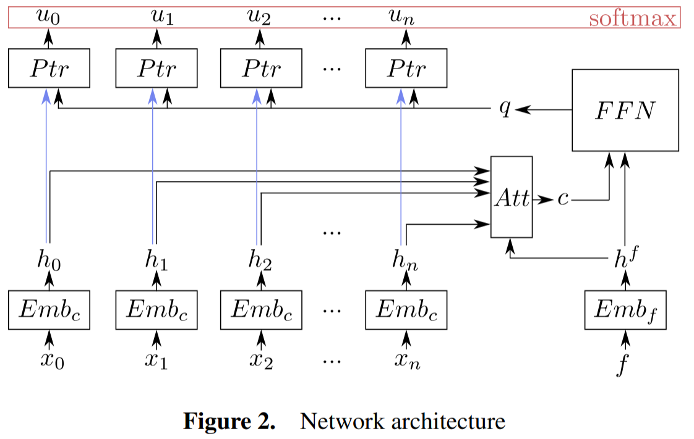

Model architecture
==================

The model is the one proposed by [HoTi20]_'s work.

The input to the model is the pair:

- :math:`X_t` -> all inputs generated using the procedure in :ref:`model_input` 
- :math:`f_t` -> reference tour end

.. _embedding_layer:

***************
Embedding layer
***************

For each of the inputs :math:`x_i \in X_t` an embedding :math:`hi` is computed using the transformation :math:`Emb_c`, i.e. two linear transformations with a ReLU activation in between where each layer has a dimensionality of :math:`d_h = 128`. This is applied to all inputs separately and identically. 
Only the reference tour end :math:`f_t` has its separate embedding layer :math:`Emb_f` with the same architecture as :math:`Emb_c` but different weights. This embedding is denoted by :math:`h^f` in the figure above.

.. _attention_layer:

***************
Attention layer
***************

This layer uses the embeddings computed in :ref:`embedding_layer` and produces a :math:`d_h` dimensional vector :math:`c` called **context vector**. This is done using the formula:

.. math::
        c = \sum_{i=0}^n \bar{a_i} h_i

where :math:`\bar{a}` is the **vector of alignment**, describing how relevant each embedding is to :math:`h^f`.

The vector of alignment is computed with the following two-step procedure:

.. math::
   u_i^H = z^A \tanh(W^A[h_i;h^f])

   \bar{a} = softmax(u_0^H, ..., u_n^H)

where :math:`z^A` is a vector and :math:`W^A` is a matrix with trainable parameters. The symbol ';' is used to denote concatenation of two vectors.

************************************
Fully Connected Feed-Forward Network
************************************
At this point, the concatenation of the vector :math:`c` and the embedding of the reference input :math:`hf` is then given to a fully connected feed-forward network with two layers (both using a ReLU activation) that outputs a :math:`dh`-dimensional vector :math:`q`. 

*************************
Output action probability
*************************
This single output vector :math:`q` is used together with each embedding :math:`h_0, ..., h_n` to calculate the output distribution over all actions:

.. math::
   p_\theta (a_t | \pi_t) = softmax(u_0, ..., u_n)

where :math:`u_i = z^B\tanh(h_i+q)`.

Notice how the output distribution is a function of the reference input and the relevant input points to the reference input.

.. toctree::
   :maxdepth: 2
