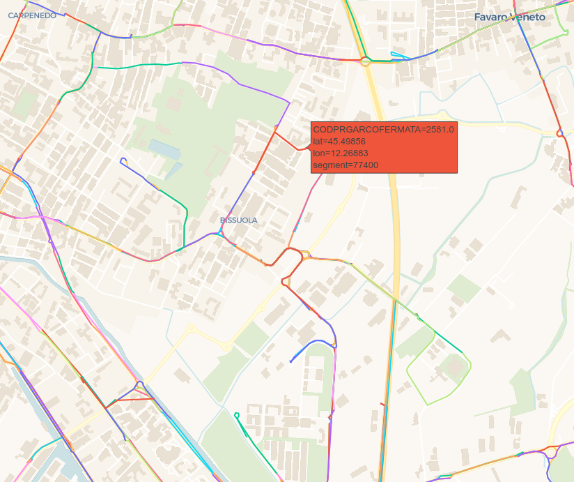
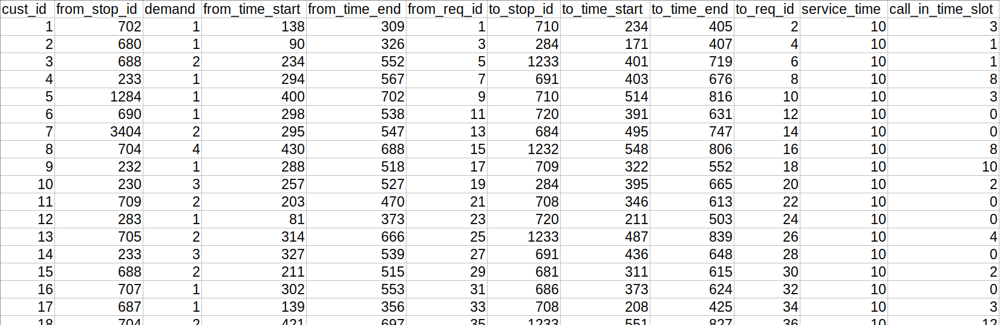
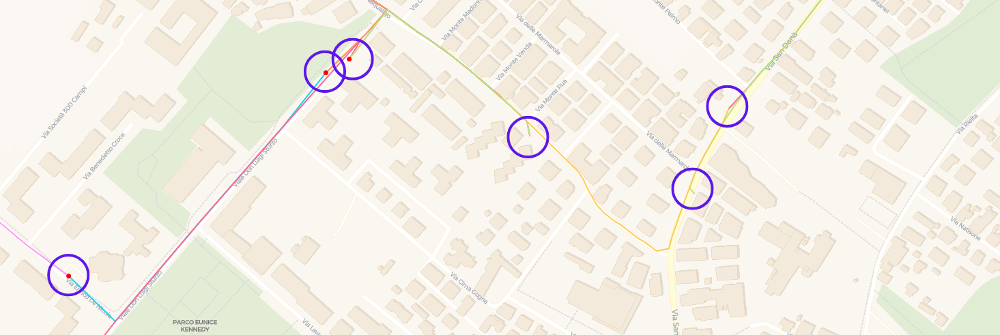

Notes on symbols and notation
=============================
This document describes the symbols and notation used in the 
documentation. Hopefully, this will help the reader to understand 
some of the choices that have been made in the implementation of 
the project.

- :ref:`types-of-data`
- :ref:`customers-vs-nodes-vs-requests`

.. _types-of-data:

------------------------------
Types of data
------------------------------
The data for the problem is composed of two main entities:

- **Geographical data**: This describes the map over which VRP is 
  performed. It contains information on *bus stops* and *streets*.
  It is convenient to represent it using graphs.
  The figure below shows an example of data with a geographical
  nature.

Of course, this data comes from tables, and is then preprocessed
and converted to graphs or interactive maps.

- **Requests data**: This represents the ride requests that the 
  users make. It is convenient to represent this data in a structured
  format, such as csv files. The following figure is an example of
  this.

.. _customers-vs-nodes-vs-requests:

------------------------------
Customers vs Nodes vs Requests
------------------------------

Real bus stops are determined by an unique ID which is referenced 
with the term **stop** throughout the code. The geographical data
is composed of **nodes** connected to each other by **arcs**. Each
arch is made of a sequence of **segments**. Each bus stop has an
associated node, but not viceversa. This means that some nodes are
not placed to represent bus stops, but simply connect different arcs
in the map.

This distinction is important because at some point in the code it
is necessary to work with nodes, and at other points it may be
better to work with stops.

The following figure shows how bus stops (marked by red dots) and nodes 
(marked by blue circles) can coexist, but are distinct concepts.

The notion of **customer** is an identifier for a *request*, which 
itself consists of:

- Pickup location
- Delivery location
- Window of pickup time
- Window of delivery time
- Number of people who will need this specific service (*demand*)

.. toctree::
   :maxdepth: 2
