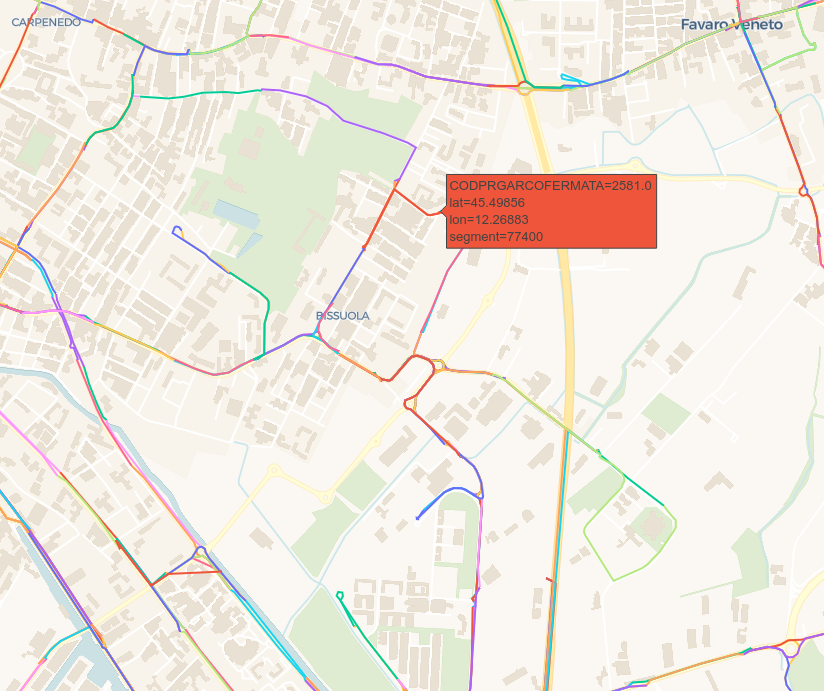
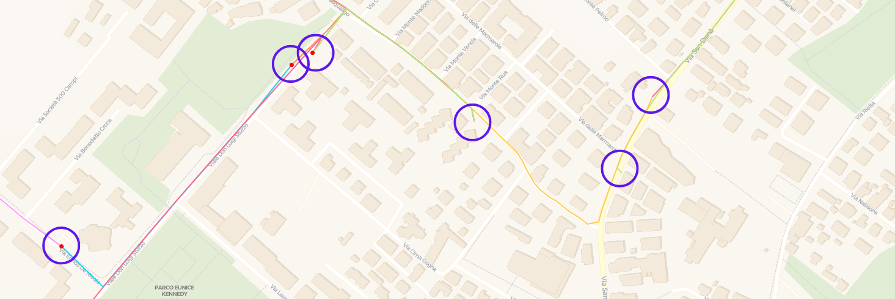
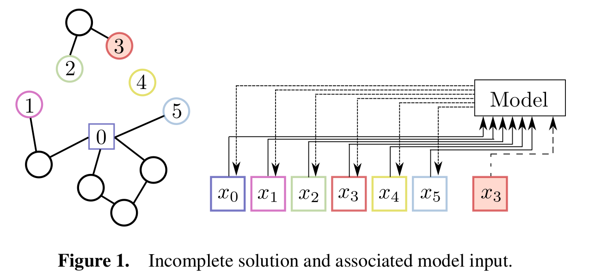
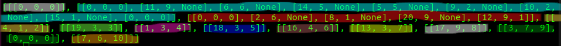
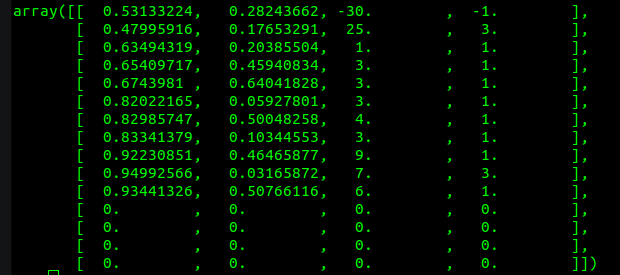
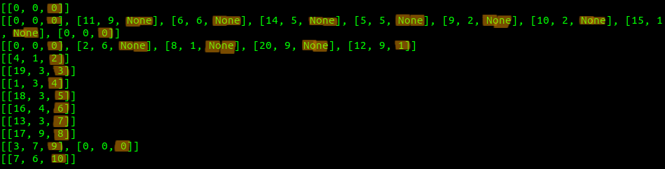

Notes on symbols and notation
=============================
This document describes the symbols and notation used in the 
documentation. Hopefully, this will help the reader to understand 
some of the choices that have been made in the implementation of 
the project.

- :ref:`types-of-data`
- :ref:`customers-vs-nodes-vs-requests`

.. _types-of-data:

------------------------------
Types of data
------------------------------
The data for the problem is composed of two main entities:

- **Geographical data**: This describes the map over which VRP is 
  performed. It contains information on *bus stops* and *streets*.
  It is convenient to represent it using graphs.
  The figure below shows an example of data with a geographical
  nature.

Of course, this data comes from tables, and is then preprocessed
and converted to graphs or interactive maps.

- **Requests data**: This represents the ride requests that the 
  users make. It is convenient to represent this data in a structured
  format, such as csv files. The following figure is an example of
  this.

.. image:: ./figures/requests_data.png
    :width: 800 px
    :align: center
    :alt: Requests data example

.. _customers-vs-nodes-vs-requests:

------------------------------
Customers vs Nodes vs Requests
------------------------------

Real bus stops are determined by an unique ID which is referenced 
with the term **stop** throughout the code. The geographical data
is composed of **nodes** connected to each other by **arcs**. Each
arch is made of a sequence of **segments**. Each bus stop has an
associated node, but not viceversa. This means that some nodes are
not placed to represent bus stops, but simply connect different arcs
in the map.

This distinction is important because at some point in the code it
is necessary to work with nodes, and at other points it may be
better to work with stops.

The following figure shows how bus stops (marked by red dots) and nodes 
(marked by blue circles) can coexist, but are distinct concepts.

The notion of **customer** is an identifier for a *request*, which 
itself consists of:

- Pickup location
- Delivery location
- Window of pickup time
- Window of delivery time
- Number of people who will need this specific service (*demand*)

.. _nlns_notation:

---------------------
Notation on NLNS code
---------------------

In this section a clarification on the notation of [HoTi20]_ is presented.

.. _loc_elements:

*****************
Location elements
*****************

A location element is a list of three values: :math:`[i_l, d, i_n]`

- :math:`i_l`: index of location (customer or depot)
- :math:`d`: demand that is fulfilled by customer :math:`i_l` in that tour
- :math:`i_n`: index of associated network input

To fully understand this notation, it is recommended to read the :ref:`solution` subsection carefully, paying attention to the code examples.

*****
Tours
*****

A tour is a list of loaction elements.

.. _solution:

********
Solution
********

A solution is a list of tours.

        **Note:** a model can ONLY obtain an input from an incomplete (aka destroyed) solution.

There is a specific representation which can be constructed from incomplete solutions. This 
representation is the **input to the model**, whose goal is to complete all the tours.

Consider an incomplete solution as the one shown on the left side of the following figure.

In this destroyed solution, the following are visible:

- A depot with index 0 (square symbol)
- A complete tour starting and ending at depot 0, denoted by the depot's square and three empty circles
- 4 Incomplete tours, where each end that is not the depot is numbered from 1 to 5 

An example of what a destroyed solution looks like in the code is the following figure, where 12 tours are highlighted with different colors. Notice how 10 of these are incomplete, while the first two are complete.

.. _model_input:

***********
Model input
***********

The network input X is a collection of vectors. These are generated as follows:

Step 1) For each incomplete tour consisting of more than one customer, a vector is created **for each end that is not the depot**.

Step 2) **For each incomplete tour with only one node**, a single vector is generated.

Step 3) A vector **for each depot** is created. 

The vectors are defined as :math:`<x^X, x^Y, x^D, x^S>` according to the table:

.. list-table:: Input vector construction
        :widths: 50 50 50 50 50
        :header-rows: 1

        * - Vector origin 
          - x^X 
          - x^Y 
          - x^D 
          - x^S  
        * - Step 1
          - x coordinate of customer 
          - y coordinate of customer 
          - sum of demands fulfilled by the tour 
          - 3 if tour contains depot, 2 otherwise 
        * - Step 2 
          - x coordinate of customer 
          - y coordinate of customer 
          - sum of demands fulfilled by the tour 
          - 1 
        * - Step 3 
          - x coordinate of depot 
          - y coordinate of depot 
          - -1 
          - -1 

In the code developed by [HoTi20]_ the vectors are split in *static* (first two components) and *dynamic* inputs (last two components), because they consider the case in which demand specifications vary during the visits of the customers. The dynamic and static inputs are concatenated to form the full input.

Here is an example of a simple input corresponding to a destroyed solution:

.. _incomplete_sol:

In the figure above, the network input is composed of 15 vectors, but the last 4 are empty. This happens because the number of vectors that a destroy operation generates depends on the *degree of destruction* as well as the complete starting point itself. As a consequence of this, the batch size is set to the largest number of elements present in the instances composing the batch. The unused vectors by a specific instance are left empty like in the figure.

A closer look at the highlighted incomplete solution above, will let us understand the notation better. In the following figure, each element of the incomplete solution has been printed on a single line for better readability. A highlighter mark shows the last component of each location element. This is breifly described in :ref:`loc_elements`, and it represents the index of the network input that the location element in the tour refers to.
Notice how the complete tour, i.e. the second printed element, has no associated index in the network input, because only incomplete tours are considered. This is not the case for the first element, although, because it represents the index and is used in other incomplete tours. In particular, the incomplete tours that contain the depot are the ones associated with the network input elements whose third column has the number 3.

Hopefully this example has highlighted the relationship between the network input and the incomplete solution seen from the python implementation. 

.. toctree::
   :maxdepth: 2
